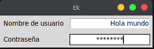
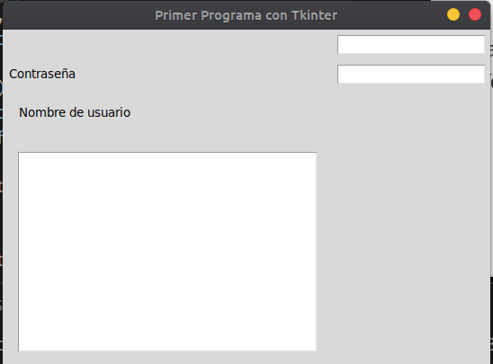
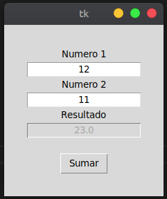
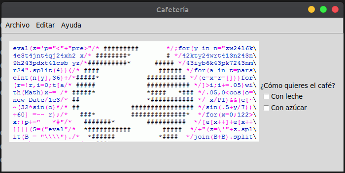
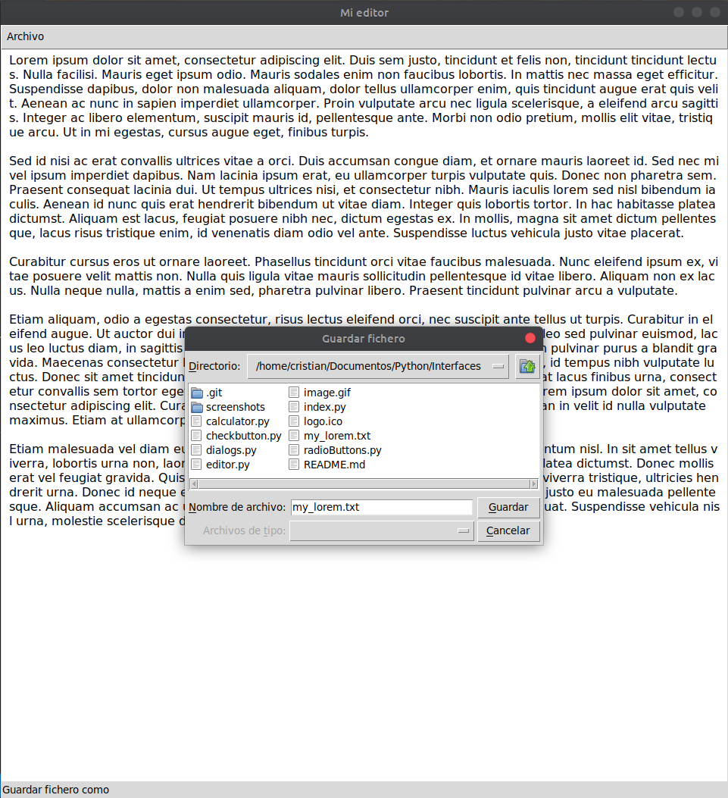

# Spyder con Tkinter
Para instalar Syder utiliza los siguientes comandos con Python 3.x: 
(Yo lo hice desde Ubuntu sino puedes ver la documentación [aquí](https://docs.spyder-ide.org/installation.html "Ir a la documentación") ):

- `sudo apt-get update`
- `sudo apt-get install spyder`
- `sudo pip install spyder`
# Screenshots
Entrada de textos

  

  

`Calculator.py`

  

`Checkbox.py`

  

`editor.py`

  

